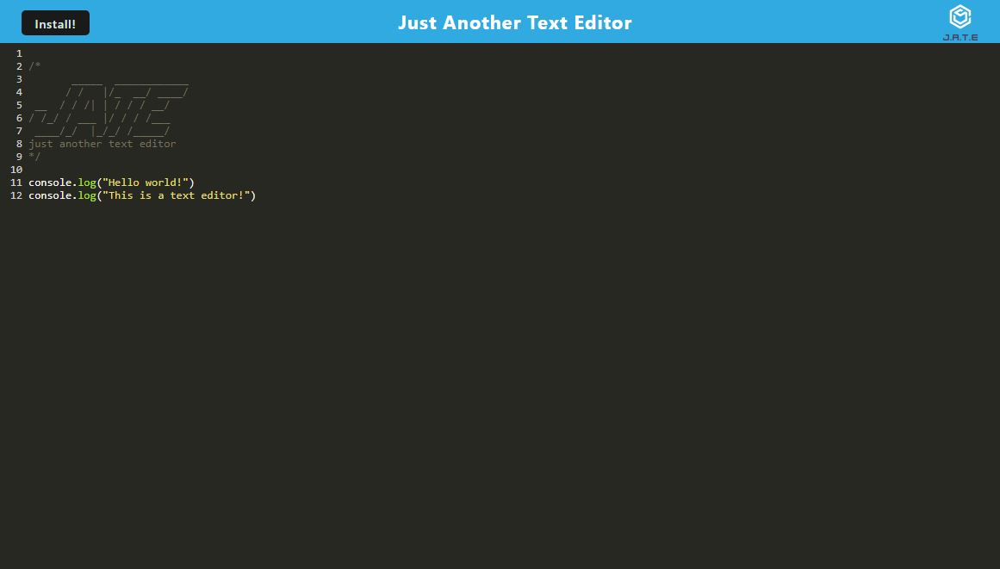

# Text-Editor-PWA

</img>

## Description

A text editor that runs in the browser; a single-page application that meets the PWA criteria. Additionally, it will feature a number of data persistence techniques that serve as redundancy in case one of the options is not supported by the browser. The application will also function offline once installed.

## LANGUAGE : Javascript, HTML, CSS

## TOOLS : Node.js, Express, Webpack

## REPOSITORY LINK

https://github.com/ViennaBorowska/Text-Editor-PWA

## DEPLOYED APP

This application has also been deployed to Heroku [here](https://safe-everglades-38405.herokuapp.com/)

## FILES

- assets - image files for README
- client > all source files, webpack config, service worker js and index page
- server > routes and server connection file
- npmrc > code to stop app running in production mode
- package-lock.json - node modules tree visiblity
- package.json - node.js metadata
- README.md - project information (this document!)

## Table of Contents

- [Installation](#installation)
- [Usage](#usage)
- [License](#license)
- [Contributing](#contributing)
- [Questions](#questions)

## Installation

Clone the GitHub Repositoty and run
`npm install`
to add the required packages and dependencies.

## Usage

Once complete, run
`npm start`
to create the webpack bundle "dist" folder. This will also initiate the IndexedDB browser API and launch the application.

You are then able to write and edit text in the editor. If you close and reopen the editor, any work you have is saved and remembered.

There is also a button to install the app to be used offline. It will be downloaded and saved to yout desktop. Work is still saved and remembered.

## License

This project is licensed under MIT

## Contributing

Contributions and improvements are always welcome. Please make your own branch and commit any changes for review. Do not push changes to the main branch.

## Questions

If you have any questions about this projects, please contact me directly via the channels below:  
Email: viennabdev@gmail.com. 
You can view more of my projects at https://github.com/ViennaBorowska.
